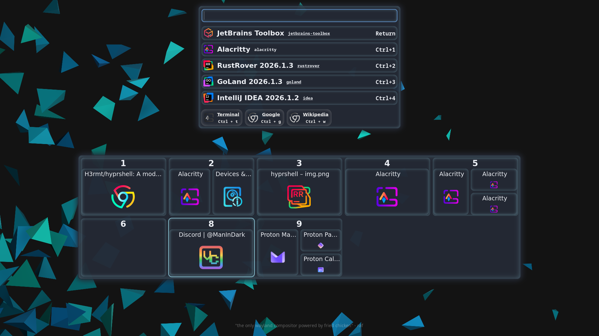
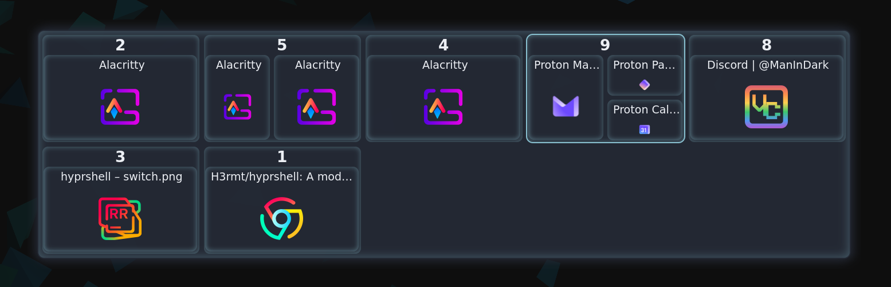
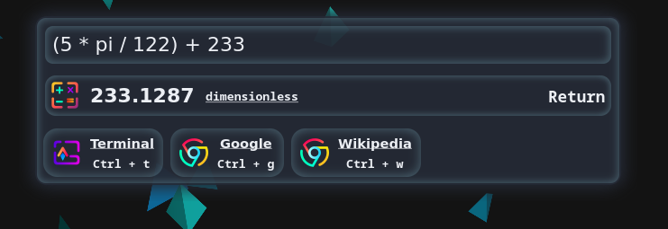

# Hyprshell

[](https://crates.io/crates/hyprshell) [](https://docs.rs/hyprshell)



## Overview

Hyprshell _(previously hyprswitch)_ is a modern GTK4-based window switcher and application launcher for [Hyprland](https://github.com/hyprwm/Hyprland).
It provides a customizable GUI for switching between windows or workspaces, launching applications, and running launcher actions from the keyboard.

## Features

- **Window Switching**: Switch between windows or workspaces using keyboard shortcuts in a GUI.
- **Customizable Keybindings**: Define your own keybindings for window switching and GUI interactions.
- **Settings App**: Customize switching, launcher behavior, keybindings and themes using a settings app.
- **Launcher Integration**: Launch applications directly from the GUI, sorted by usage frequency.
- **Launcher Plugins**: Different plugins like Web search, terminal commands, actions or calculations can be enabled.
- **Theming**: Customize the GUI appearance (gtk4) using [CSS](docs/CONFIGURE.md), Settings app comes with some default themes.
- **Dynamic Configuration**: Automatically reloads configuration/style changes without restarting the application.
- **CLI Tooling**: Validate configs, change default applications, inspect launch history and generate shell completions.
- **Debug commands**: Many [Commands](docs/DEBUG.md) to debug desktop files, icons, launcher matching and default applications.
- **Nix Support**: Includes a flake and home-manager module for Nix-based setups.

## Installation

**Minimum hyprland version: 0.55.0, using lua for configuration**

[](https://repology.org/project/hyprshell/versions)

### Arch Linux (AUR)

```bash
paru -S hyprshell
# or
yay -S hyprshell
```

Use `hyprshell-bin` for the pre-built binaries from GitHub releases.

Use `hyprshell-slim` for the [slim](#feature-flags) version (faster buildtime).

### Binary pre-built packages (only for x86_64 and aarch64)

Download and extract from the latest release on the [releases](https://github.com/h3rmt/hyprshell/releases) page.

### NixOS

Hyprshell is also available in `nixpkgs` repository and can be configured using a generic `home-manager` module.

This repository also contains a `flake` and a type-safe `home-manager` module for configuration.

Please read [NixOS](docs/NIX.md) if you use flakes.

### From Source

hyprland, gtk4[v4_18], libadwaita[v1_8] and [gtk4-layer-shell](https://github.com/wmww/gtk4-layer-shell)[1.1.1] must be installed

```bash
cargo install hyprshell
```

Build with less features in [slim](#feature-flags) mode

```bash
cargo install hyprshell --no-default-features --features "slim"
```

Minimum required rustc version: `1.91.0`

## Usage

Run `hyprshell --help` to see available commands and options.

### Config

To generate or edit a configuration, run `hyprshell config generate`, `hyprshell config edit` or launch the `Hyprshell Settings Editor` App.

To validate or explain the current configuration, use `hyprshell config check` and `hyprshell config explain`.

<div style="display:flex;gap:8px;align-items:flex-start">
  
  
</div>

### Initialization

Enable the systemd service (generated with `hyprshell config generate`) [recommended]:

```bash
systemctl --user enable --now hyprshell.service
```

Or add the following to your Hyprland configuration (`~/.config/hypr/hyprland.conf`):

```ini
hl.on("hyprland.start", function()
    -- Run hyprshell daemon
    hl.exec_cmd("hyprshell run")
end)
```




### Debugging

Debug commands are provided to help troubleshoot desktop files, icons, launcher search results, default applications and general system information, see [Debug.md](docs/DEBUG.md) for detailed information about available commands and their usage.

### Feature Flags

✅ = included in the default feature set.

✨ = included in the slim feature set. (build with ``--no-default-features --features "slim"``)

- `gui_settings_editor`✅✨: Adds the `hyprshell config edit` command to open the settings editor.
- `json5_config`✅: Adds support for a json5 config file.
- `launcher_calc`✅: Adds support for the calc plugin in the launcher.
- `debug_command`✅✨: Adds the `hyprshell debug` command to debug icons, desktop files, etc.
- `clipboard_compress_lz4`✅✨: Adds support for compressing clipboard content using lz4.
- `clipboard_compress_brotli`✅: Adds support for compressing clipboard content using brotli.
- `clipboard_compress_zstd`✅: Adds support for compressing clipboard content using zstd.
- `clipboard_encrypt_chacha20poly1305`✅: Adds support for encrypting clipboard content using chacha20poly1305.
- `clipboard_encrypt_aes_gcm`✅: Adds support for encrypting clipboard content using aes_256_gcm.
- `ci_config_check`: (!used for ci tests) Adds a command to check if the loaded config is equal to the default config or the full config. Also diables loading of configs without all values.

### Env Variables

- `HYPRSHELL_NO_LISTENERS`: Disable all config listeners (config file, css file, hyprland config, monitor count)
- `HYPRSHELL_NO_ALL_ICONS`: Don't check for all icons on fs and just use the ones provided by the `gtk4` icon theme.
- `HYPRSHELL_RELOAD_DELAY`: Set the delay for starting the restart listeners(config, css, monitors, hypr-config) in milliseconds (default: `1000`).
- `HYPRSHELL_RELOAD_DEBOUNCE`: Set the debounce time in milliseconds for reloading hyprshell after message from restart listeners (default: `2000`).
- `HYPRSHELL_LOG_MODULE_PATH`: Add the module path to each log message. (use with -vv)
- `HYPRSHELL_EXPERIMENTAL`: Enables experimental features (grep through the source code for `"HYPRSHELL_EXPERIMENTAL"` to see them)
- `HYPRSHELL_RUN_ACTIONS_IN_DEBUG`: Run actions from launcher plugin in debug mode
